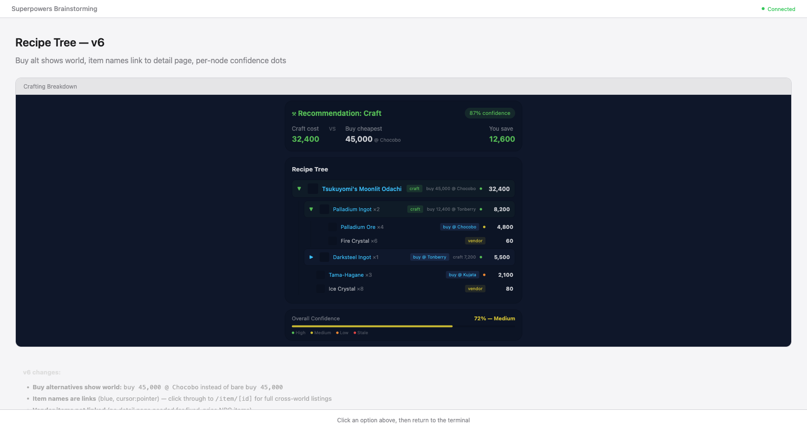

# Crafting Breakdown Section on Item Detail Page

**Linear:** ENG-66
**Date:** 2026-04-13

## Mockup

## Overview

Add a Crafting tab to the `/item/[id]` page showing a cost breakdown, recipe tree with craft/buy/vendor decisions, and per-node confidence indicators. Only enabled for craftable items. Data sourced from `GET /api/craft/[id]` (ENG-65).

## Page Structure: Tabs

The item detail page gains a tab bar below the item header:

- **Market** (default) — existing content: Cross-World Listings, Sale History, Price Statistics
- **Crafting** — new content described below

Tab behavior:
- Non-craftable items: Crafting tab is visible but greyed out / disabled
- Tab state stored in URL (query param or hash) for shareability
- Selecting Crafting tab fetches from `/api/craft/[id]` on the client

## Crafting Tab Layout

Max-width ~520px, centered. Three sections stacked vertically:

### 1. Summary Card

Compact recommendation at the top:

| Field | Source |
|-------|--------|
| Recommendation | `craft` or `buy` (from `root.action`) |
| Craft cost | `totalCost` |
| Buy cheapest | `cheapestListing.price` + `cheapestListing.world` |
| You save | difference between buy and craft (only shown when craft is recommended) |
| Confidence | `confidence` as percentage + badge (High/Medium/Low/Stale) |

When recommendation is "buy", adjust framing: show buy price prominently, craft cost as the alternative.

### 2. Recipe Tree

Recursive tree rendering `CraftingNode`. Three visual node types:

#### Craft node (expanded by default)
- Bordered card with faint green tint
- **▼** collapse arrow (green)
- Item icon (XIVAPI) + item name (blue link to `/item/[id]`) + ×quantity
- Action badge: `craft` (green) + alternative: `buy {marketPrice} @ {marketWorld}` (dimmed)
- Per-node confidence dot (colored: green/amber/orange/red)
- Total cost right-aligned
- Children rendered below, indented with vertical tree line (border-left)

#### Buy node with recipe (collapsed by default)
- Bordered card with faint blue tint
- **▶** expand arrow (blue) — click to expand and see sub-recipe
- Item icon + item name (blue link) + ×quantity
- Action badge: `buy @ {marketWorld}` (blue) + alternative: `craft {craftCost}` (dimmed)
- Per-node confidence dot
- Total cost right-aligned
- When expanded, shows children (the recipe ingredients) indented below

#### Leaf node (buy or vendor, no recipe)
- No border, no card — simple inline row
- Item icon + item name (blue link for buy, plain text for vendor) + ×quantity
- Action badge: `buy @ {world}` (blue) or `vendor` (amber)
- Per-node confidence dot (buy nodes only; vendor nodes omit it — price is fixed)
- Total cost right-aligned

#### Tree rendering rules
- All nodes: cost is right-aligned in a consistent column
- Indentation: 14px per level (10px on mobile)
- Vertical tree lines: `border-left` on indented containers
- Fully expanded by default; user can collapse/expand craft nodes and buy-with-recipe nodes
- Item icons: XIVAPI URLs, fallback to grey placeholder on error

### 3. Confidence Footer

- Overall confidence bar (min across all nodes)
- Legend: colored dots for High / Medium / Low / Stale thresholds

Confidence thresholds (existing scale):
- ≥ 0.85: green (`#5b5`) — High
- ≥ 0.60: amber (`#cb3`) — Medium
- ≥ 0.25: orange (`#e83`) — Low
- < 0.25: red (`#d44`) — Stale

## States

| State | Display |
|-------|---------|
| Loading | Skeleton: summary card shape + 4-5 tree row placeholders |
| Error (API failure) | Error card with message + retry button |
| 202 (cache not ready) | "Market data still loading..." with scan progress |
| 404 (no recipe) | Safety net — should not occur since tab is disabled for non-craftable items |

## Responsive / Mobile

- Summary card: stack craft cost and buy cheapest vertically on narrow screens
- Tree nodes: wrap to two lines on narrow screens — name + quantity on first line, badges + cost on second
- Tree indentation: reduced (10px) on mobile to conserve horizontal space
- Tabs: full-width on mobile

## Data Flow

1. Page loads → `+page.server.ts` returns `itemID`, `twName`, and `hasRecipe` (boolean, from recipe cache)
2. Market tab renders immediately (existing behavior)
3. If user selects Crafting tab (or arrives via URL with tab param):
   - Client fetches `GET /api/craft/[id]`
   - Renders summary, tree, confidence from the `CraftingResult` response
4. Item names in the tree link to `/item/[id]` for full cross-world listings

## Component Structure

- `CraftingBreakdown.svelte` — top-level component for the Crafting tab content
  - Handles fetch, loading/error states
  - Renders summary card, tree, confidence footer
- `CraftingNode.svelte` — recursive component for a single tree node
  - Accepts `CraftingNode` data + depth level
  - Handles expand/collapse state
  - Renders appropriate visual type (craft card / buy-with-recipe card / leaf row)

## Out of Scope

- Sell price / profit calculations (irrelevant to "how to best get this item")
- Alternative buy sources per node (API returns single cheapest; user clicks through to item detail for full listings)
- Multi-recipe selection (API already picks the best recipe)
- Expanding the craft API response shape
